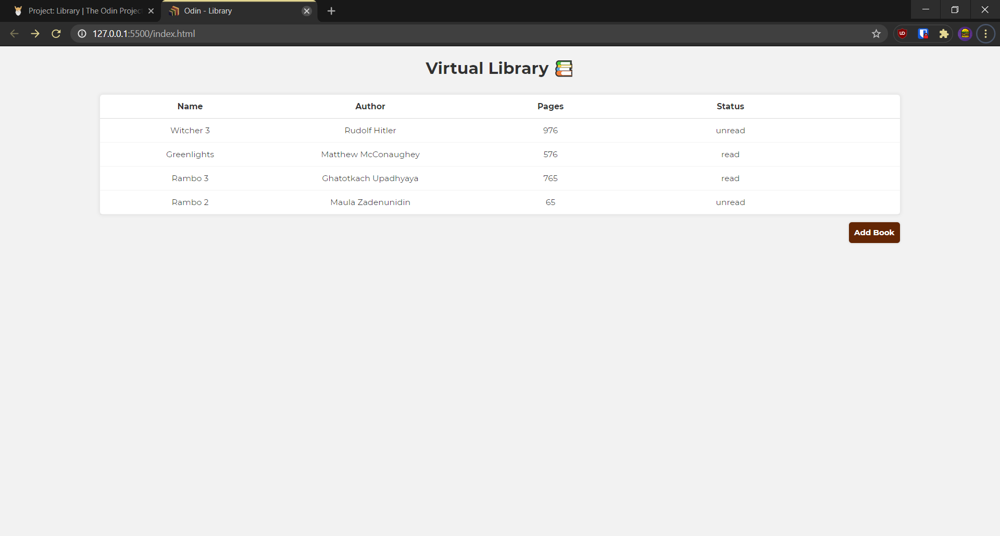

# Odin Project Library Project

Vanilla JS Project from [The Odin Project](https://www.theodinproject.com/lessons/library)

Uses local storage to add, remove and check books from the table.

Check it out live at - 